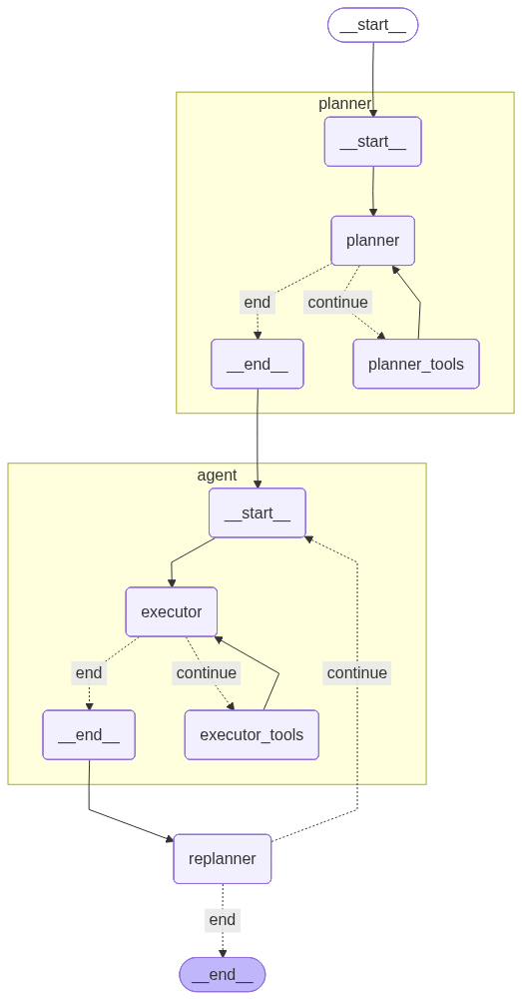

# MetaMind: LLM-Orchestrated Computational Intelligence Framework

## Complete Technical Documentation

---

## Table of Contents

1. [Executive Summary](#executive-summary)
2. [Architecture Overview](#architecture-overview)
3. [Core Concepts](#core-concepts)
4. [System Components](#system-components)
5. [Computational Intelligence Methods](#computational-intelligence-methods)
6. [Workflow and Execution Flow](#workflow-and-execution-flow)
7. [State Management](#state-management)
8. [Data Flow and Reference System](#data-flow-and-reference-system)
9. [LLM Integration](#llm-integration)
10. [Tool System](#tool-system)
11. [Advanced Features](#advanced-features)
12. [Configuration and Setup](#configuration-and-setup)
13. [Usage Examples](#usage-examples)
14. [Q&A and Examples](#qa-and-examples)
15. [Troubleshooting](#troubleshooting)
16. [Performance Optimization](#performance-optimization)
17. [Future Extensions](#future-extensions)
18. [References and Resources](#references-and-resources)

---

## Executive Summary

**MetaMind** is a sophisticated multi-agent system that combines Large Language Models (LLMs) with Computational Intelligence (CI) algorithms to solve complex optimization, classification, clustering, and regression problems. The framework employs a hierarchical architecture with three specialized agents (Planner, Executor, and Replanner) working in concert to analyze problems, generate execution plans, execute CI algorithms, and evaluate results.

### Key Features

- **Automated Problem Analysis**: Intelligent classification of problem types and method selection
- **Multi-Algorithm Support**: 9+ CI methods including neural networks, evolutionary algorithms, and swarm intelligence
- **Adaptive Planning**: Dynamic plan adjustment based on execution results
- **External Data Integration**: Seamless loading and processing of CSV and TSP files
- **Comprehensive Metrics**: Detailed performance analysis with domain-specific metrics
- **Conversational Memory**: Persistent conversation history across sessions
- **Parameter Optimization**: Automatic parameter tuning based on user preferences (speed/accuracy)

### Supported Problem Domains

| Domain | Methods | Use Cases |
|--------|---------|-----------|
| **Classification** | Perceptron, MLP | Binary/multi-class classification, pattern recognition |
| **Clustering** | SOM | Customer segmentation, data visualization |
| **Optimization** | GA, PSO, ACO | TSP, routing, function optimization |
| **Regression** | Fuzzy Systems, GP | Control systems, symbolic regression |
| **Pattern Completion** | Hopfield Networks | Associative memory, noise reduction |

---

## Architecture Overview

### High-Level Architecture

MetaMind employs a **Plan and Execution graph architecture** with an outer planning loop and an inner execution loop:



### Agent Responsibilities

#### 1. **Planner Agent**
- **Role**: Problem analysis and plan generation
- **Input**: User's natural language problem description
- **Output**: Structured execution plan with steps, tools, and parameters
- **LLM Model**: Configurable
- **Key Functions**:
  - Problem type classification (TSP, classification, clustering, etc.)
  - Method selection based on problem characteristics
  - Parameter tuning based on user preferences (speed vs accuracy)
  - Data loading step insertion for external files
  - Confidence scoring and backup method selection

#### 2. **Executor Agent** (Inner Loop)
- **Role**: Tool execution with ReAct pattern
- **Input**: Individual execution step from plan
- **Output**: Tool execution results
- **LLM Model**: Configurable
- **Key Functions**:
  - Tool invocation with parameter resolution
  - Data reference resolution ($DATA, $MODEL placeholders)
  - Error handling and result parsing
  - Model ID and data storage

#### 3. **Replanner Agent**
- **Role**: Result evaluation and decision making
- **Input**: Execution results and metrics
- **Output**: Decision (continue/adjust/replan/complete)
- **LLM Model**: Configurable
- **Key Functions**:
  - Metrics analysis and performance assessment
  - Convergence evaluation
  - Plan adjustment recommendations
  - Final result synthesis and reporting

---

## Core Concepts

### 1. Plan-Execute-Replan Paradigm

MetaMind follows a **cyclical planning paradigm**:

```
User Input → Plan → Execute → Evaluate → [Replan/Continue/Complete]
                       ▲                           │
                       └───────────────────────────┘
```

This approach provides:
- **Adaptability**: Plans can be adjusted based on intermediate results
- **Robustness**: Failures trigger replanning rather than complete failure
- **Optimization**: Parameters can be tuned iteratively
- **Transparency**: Each step is explicitly planned and traceable

### 2. Hierarchical State Management

The system maintains two levels of state:

**Outer State (PlanExecutionState)**:
- Complete conversation history
- Overall execution plan
- Current step index
- Past step results
- Model and data stores
- Iteration counter

**Inner State (AgentExecutorState)**:
- Step-specific messages
- Current tool to execute
- Step result
- Temporary execution context

### 3. Reference Resolution System

MetaMind uses a **placeholder-based reference system** to handle data flow between steps:

- **$DATA.<key>**: References data loaded from external files
- **$MODEL**: References trained model IDs

Example:
```json
{
  "step_id": 2,
  "tool_name": "train_mlp_tool",
  "tool_args": {
    "X_train": "$DATA.X_train",
    "y_train": "$DATA.y_train",
    "hidden_layers": [64, 32]
  }
}
```

### 4. Tool Registry Pattern

All tools are centralized in a registry (`tool_registry.py`):
- Consistent tool discovery
- Metadata association (data loading tools, output keys)
- Easy extension with new tools

---

## System Components

### 1. State Definitions (`state.py`)

#### PlanStep
Represents a single step in the execution plan:
```python
class PlanStep(BaseModel):
    step_id: int                    # Sequential step number
    description: str                # Human-readable description
    tool_name: Optional[str]        # LangChain tool name
    tool_args: Optional[Dict]       # Tool parameters
    status: str                     # pending/in_progress/completed/failed
    result: Optional[Any]           # Execution result
    error: Optional[str]            # Error message if failed
```

#### Plan
Complete execution plan:
```python
class Plan(BaseModel):
    problem_type: str               # tsp/classification/clustering/etc.
    selected_method: str            # Primary CI method
    reasoning: str                  # Method selection rationale
    steps: List[PlanStep]           # Ordered execution steps
    backup_method: Optional[str]    # Alternative if primary fails
    confidence: float               # 0.0-1.0 confidence score
```

#### PlanExecutionState
Main state container:
```python
class PlanExecutionState(TypedDict):
    messages: List[BaseMessage]           # Conversation history
    input: str                            # Current user input
    plan: Optional[Plan]                  # Current execution plan
    current_step_index: int               # Progress tracker
    past_steps: List[Tuple]               # (step, result) history
    final_response: Optional[str]         # Result for user
    execution_result: Optional[...]       # Structured result
    iteration_count: int                  # Replanning iterations
    should_replan: bool                   # Control flag
    model_store: Dict[str, str]           # {method: model_id}
    data_store: Dict[str, Any]            # {key: loaded_data}
```

### 2. Node Functions (`nodes.py`)

#### plan_step()
**Purpose**: Analyze problem and generate execution plan

**Process**:
1. Receive user input and conversation history
2. Invoke Planner LLM with system prompt
3. Parse JSON plan from LLM response
4. Create Plan and PlanStep objects
5. Return updated state with plan

**Error Handling**:
- JSON parsing failures → default single-step plan
- Invalid tool names → error step
- Missing required fields → use defaults

#### execute_step()
**Purpose**: Execute each step in the plan

**Process**:
1. Initialize model/data stores from state
2. Iterate through plan steps:
   - Resolve $DATA and $MODEL references
   - Inject model_id for inference tools
   - Create instruction for executor
   - Invoke inner executor graph
   - Parse and store results
   - Update model_store and data_store
3. Return updated state with results

**Key Features**:
- **Data Reference Resolution**: Replaces $DATA placeholders with actual data
- **Model ID Injection**: Automatically provides model_id to inference tools
- **Result Parsing**: Extracts structured results from tool outputs
- **Storage Management**: Maintains model and data stores across steps

#### replan_step()
**Purpose**: Evaluate results and decide next action

**Process**:
1. Review past step results
2. Extract metrics and assess performance
3. Invoke Replanner LLM with evaluation prompt
4. Parse decision (continue/adjust/replan/complete)
5. Generate final response if complete
6. Return decision and updated state

**Decision Logic**:
- **Continue**: Move to next step (steps remaining, no issues)
- **Adjust**: Retry current step with modified parameters
- **Replan**: Generate new plan with different method
- **Complete**: All steps done, generate final analysis

### 3. Graph Construction (`agent.py`)

#### Inner Executor Graph
Implements a mini-ReAct loop for tool execution:

```python
def build_executor_graph():
    builder = StateGraph(AgentExecutorState)
    builder.add_node("executor", call_executor)
    builder.add_node("executor_tools", ToolNode(tools=ALL_TOOLS))
    
    builder.set_entry_point("executor")
    builder.add_conditional_edges(
        "executor",
        should_continue_executor_tools,
        {"continue": "executor_tools", "end": END}
    )
    builder.add_edge("executor_tools", "executor")
    
    return builder.compile()
```

**Flow**:
1. Executor receives instruction → generates tool call
2. Tool executes → returns result
3. Executor receives result → generates summary
4. End

#### Outer Planning Graph
Main orchestration graph:

```python
def build_graph():
    graph = StateGraph(PlanExecutionState)
    
    graph.add_node("planner", plan_step)
    graph.add_node("agent", execute_step)
    graph.add_node("replanner", replan_step)
    
    graph.set_entry_point("planner")
    graph.add_edge("planner", "agent")
    graph.add_edge("agent", "replanner")
    graph.add_conditional_edges(
        "replanner",
        should_continue,
        {"continue": "agent", "end": END}
    )
    
    return graph
```

**Flow**:
1. Planner creates plan
2. Agent executes all steps
3. Replanner evaluates → continue or end
4. If continue → back to agent
5. If end → return final response

---

## Computational Intelligence Methods

### 1. Neural Networks

#### Perceptron
**Use Case**: Binary classification, linearly separable data

**Algorithm**: Single-layer linear classifier with weight updates

**Parameters**:
```python
{
    "X_train": [[...]],           # Training features
    "y_train": [...],             # Binary labels (0/1 or -1/1)
    "learning_rate": 0.01,        # Weight update step size
    "max_epochs": 100,            # Maximum training iterations
    "bias": true                  # Include bias term
}
```

**Training Process**:
1. Initialize weights randomly
2. For each epoch:
   - For each sample: predict → compare → update weights
   - Check convergence (no misclassifications)
3. Return trained model ID

**Metrics**:
- Accuracy, Precision, Recall, F1-score
- Confusion matrix
- Number of epochs to convergence

**When to Use**:
- Binary classification
- Linearly separable data
- Fast training required
- Interpretability important

#### Multi-Layer Perceptron (MLP)
**Use Case**: Multi-class classification, non-linear patterns, complex datasets

**Algorithm**: Feedforward neural network with backpropagation

**Architecture**:
```
Input Layer → Hidden Layer(s) → Output Layer
              (ReLU/Sigmoid)     (Softmax)
```

**Parameters**:
```python
{
    "X_train": [[...]],
    "y_train": [[...]],           # One-hot encoded labels
    "hidden_layers": [64, 32],    # Neurons per hidden layer
    "activation": "relu",         # relu/sigmoid/tanh
    "learning_rate": 0.001,
    "max_epochs": 500,
    "batch_size": 32,
    "optimizer": "adam"           # adam/sgd/rmsprop
}
```

**Training Process**:
1. Initialize weights (Xavier/He initialization)
2. For each epoch:
   - Shuffle data
   - For each batch:
     - Forward pass: compute activations
     - Compute loss (cross-entropy)
     - Backward pass: compute gradients
     - Update weights (optimizer)
   - Validate on validation set
3. Early stopping if validation loss increases

**Metrics**:
- Accuracy, Precision, Recall, F1 (per class)
- Training/validation loss curves
- Confusion matrix
- Computational time

**When to Use**:
- Multi-class classification
- Non-linear decision boundaries
- Medium to large datasets (>1000 samples)
- High accuracy requirements

**Parameter Tuning Guide**:
- **hidden_layers**: Start with [64, 32], increase for complex patterns
- **learning_rate**: 0.001 typical, decrease if unstable, increase for faster convergence
- **batch_size**: 32 typical, increase for large datasets
- **max_epochs**: Monitor validation loss, use early stopping

#### Self-Organizing Map (SOM)
**Use Case**: Clustering, visualization, dimensionality reduction

**Algorithm**: Unsupervised competitive learning on 2D grid

**Parameters**:
```python
{
    "X_train": [[...]],
    "map_size": [10, 10],              # Grid dimensions
    "learning_rate_initial": 0.5,
    "learning_rate_final": 0.01,
    "neighborhood_initial": 5.0,       # Initial neighborhood radius
    "max_epochs": 1000,
    "topology": "rectangular"          # rectangular/hexagonal
}
```

**Training Process**:
1. Initialize map weights randomly
2. For each epoch:
   - Select random sample
   - Find Best Matching Unit (BMU)
   - Update BMU and neighbors
   - Decay learning rate and neighborhood
3. Return trained map

**Metrics**:
- Quantization error
- Topographic error
- Cluster purity (if labels available)
- Visualization quality

**When to Use**:
- Customer segmentation
- Data exploration
- High-dimensional data visualization
- Pattern discovery

#### Hopfield Network
**Use Case**: Associative memory, pattern completion, noise reduction

**Algorithm**: Recurrent network with energy minimization

**Parameters**:
```python
{
    "patterns": [[-1, 1, ...]],   # Binary patterns to memorize
    "max_iterations": 100,
    "threshold": 0.0,
    "async_update": true,         # Asynchronous vs synchronous
    "energy_threshold": 1e-6
}
```

**Training Process**:
1. Compute weight matrix from patterns (Hebbian rule)
2. Store network configuration

**Inference Process**:
1. Initialize with noisy/partial pattern
2. Iteratively update neurons:
   - Compute activation
   - Apply threshold
   - Check energy convergence
3. Return recovered pattern

**Metrics**:
- Pattern recovery accuracy
- Hamming distance to original
- Number of iterations to convergence
- Stability analysis

**When to Use**:
- Pattern completion
- Error correction
- Content-addressable memory
- Small discrete patterns

### 2. Fuzzy Systems

**Use Case**: Control systems, regression with interpretable rules

**Algorithm**: Fuzzy inference with Wang-Mendel rule learning

**Components**:
- **Fuzzification**: Convert crisp inputs to fuzzy sets
- **Rule Base**: IF-THEN rules learned from data
- **Inference**: Evaluate rules, aggregate outputs
- **Defuzzification**: Convert fuzzy output to crisp value

**Parameters**:
```python
{
    "X_train": [[...]],
    "y_train": [...],
    "n_membership_functions": 3,      # 3/5/7 (Low/Med/High)
    "membership_type": "triangular",  # triangular/gaussian/trapezoidal
    "defuzzification": "centroid",    # centroid/mom/bisector
    "rule_generation": "wang_mendel"
}
```

**Training Process (Wang-Mendel)**:
1. Partition input/output spaces into fuzzy sets
2. For each data point:
   - Find membership degrees
   - Generate rule (highest membership → output)
3. Resolve conflicts (keep rule with highest degree)
4. Store rule base

**Inference Process**:
1. Fuzzify inputs
2. Evaluate all rules (firing strengths)
3. Aggregate rule outputs
4. Defuzzify to get crisp output

**Metrics**:
- MSE, RMSE, MAE
- R² score
- Number of rules
- Output range coverage

**When to Use**:
- Control systems (temperature, speed, etc.)
- Regression with interpretability requirements
- Expert knowledge encoding
- Nonlinear relationships

**Membership Function Selection**:
- **Triangular**: Fast, simple, good general purpose
- **Gaussian**: Smooth transitions, natural for sensor data
- **Trapezoidal**: Robust to noise, plateau regions

### 3. Evolutionary Algorithms

#### Genetic Algorithm (GA)
**Use Case**: TSP, combinatorial optimization, permutation problems

**Algorithm**: Evolution-based search with crossover and mutation

**Parameters**:
```python
{
    "distance_matrix": [[...]],
    "population_size": 100,
    "generations": 500,
    "crossover_rate": 0.8,
    "mutation_rate": 0.1,
    "selection": "tournament",        # tournament/roulette/rank
    "tournament_size": 3,
    "elitism": 2,                     # Preserve best individuals
    "crossover_type": "pmx",          # pmx/ox/cx
    "known_optimal": null             # For metrics
}
```

**Algorithm Flow**:
1. **Initialization**: Generate random population of tours
2. **Evaluation**: Calculate fitness (tour length)
3. **Selection**: Choose parents for reproduction
4. **Crossover**: Combine parent tours (PMX, OX, etc.)
5. **Mutation**: Random swap/inversion
6. **Replacement**: Form new generation with elitism
7. **Termination**: Repeat until max generations

**Crossover Operators**:
- **PMX (Partially Mapped Crossover)**: Preserve relative order
- **OX (Order Crossover)**: Preserve absolute order
- **CX (Cycle Crossover)**: Preserve positions

**Metrics**:
- Best tour length
- Optimality gap (if known optimal)
- Convergence speed
- Population diversity
- Success rate over multiple runs

**When to Use**:
- Traveling Salesman Problem
- Scheduling problems
- Resource allocation
- Any permutation-based optimization

**Parameter Tuning**:
- **population_size**: 50-200, larger for complex problems
- **crossover_rate**: 0.7-0.9, higher for exploitation
- **mutation_rate**: 0.05-0.2, higher for exploration
- **elitism**: 2-5, preserve best solutions

#### Genetic Programming (GP)
**Use Case**: Symbolic regression, discovering mathematical formulas

**Algorithm**: Evolve tree-based mathematical expressions

**Parameters**:
```python
{
    "X_train": [...],
    "y_train": [...],
    "population_size": 200,
    "generations": 50,
    "max_depth": 6,
    "crossover_rate": 0.9,
    "mutation_rate": 0.1,
    "function_set": ["+", "-", "*", "/"],
    "terminal_set": ["x", "constants"],
    "parsimony_coefficient": 0.001    # Penalize complexity
}
```

**Representation**: Expression trees
```
      +
     / \
    *   x
   / \
  x   2
→ (x * 2) + x
```

**Algorithm Flow**:
1. Initialize random expression trees
2. Evaluate fitness (MSE on training data)
3. Apply parsimony pressure (penalize complex trees)
4. Tournament selection
5. Subtree crossover
6. Point/subtree mutation
7. Repeat until convergence

**Metrics**:
- Best formula found
- MSE, R² on train/test
- Tree depth/complexity
- Convergence history

**When to Use**:
- Discovering unknown relationships
- Interpretable regression
- Feature engineering
- Scientific modeling

### 4. Swarm Intelligence

#### Particle Swarm Optimization (PSO)
**Use Case**: Continuous function optimization

**Algorithm**: Swarm-based search inspired by bird flocking

**Parameters**:
```python
{
    "function_name": "rastrigin",     # rastrigin/ackley/rosenbrock/sphere
    "dimensions": 10,
    "n_particles": 50,
    "max_iterations": 500,
    "w": 0.7,                         # Inertia weight
    "c1": 1.5,                        # Cognitive coefficient
    "c2": 1.5,                        # Social coefficient
    "w_decay": true,                  # Decrease w over time
    "velocity_clamp": 0.5,
    "custom_bounds": null
}
```

**Velocity Update**:
```
v[i] = w*v[i] + c1*r1*(pbest[i] - x[i]) + c2*r2*(gbest - x[i])
x[i] = x[i] + v[i]
```

**Algorithm Flow**:
1. Initialize particles randomly in search space
2. Evaluate fitness for each particle
3. Update personal best (pbest) and global best (gbest)
4. Update velocities and positions
5. Apply boundary constraints
6. Repeat until convergence or max iterations

**Benchmark Functions**:
- **Rastrigin**: Highly multimodal, many local optima
- **Ackley**: Nearly flat outer region, central peak
- **Rosenbrock**: Narrow curved valley
- **Sphere**: Simple unimodal test

**Metrics**:
- Best fitness found
- Distance to global optimum
- Convergence speed
- Population diversity

**When to Use**:
- Continuous optimization
- High-dimensional spaces
- Non-differentiable functions
- Fast convergence needed

**Parameter Guidelines**:
- **w**: Start 0.9, decay to 0.4 for balance
- **c1, c2**: 1.5-2.0, equal for balanced search
- **n_particles**: 20-100, scale with dimensions

#### Ant Colony Optimization (ACO)
**Use Case**: TSP, routing, graph-based optimization

**Algorithm**: Pheromone-based probabilistic search

**Parameters**:
```python
{
    "distance_matrix": [[...]],
    "n_ants": 50,
    "max_iterations": 500,
    "alpha": 1.0,                     # Pheromone importance
    "beta": 2.0,                      # Heuristic importance
    "evaporation_rate": 0.5,
    "q": 1.0,                         # Pheromone deposit
    "initial_pheromone": 0.1,
    "local_search": true,             # 2-opt improvement
    "known_optimal": null
}
```

**Probability of Moving from i to j**:
```
P[i][j] = (τ[i][j]^α * η[i][j]^β) / Σ(τ[i][k]^α * η[i][k]^β)

where:
  τ = pheromone level
  η = heuristic (1/distance)
  α = pheromone weight
  β = heuristic weight
```

**Algorithm Flow**:
1. Initialize pheromone trails
2. For each iteration:
   - Each ant constructs a tour probabilistically
   - Apply local search (optional)
   - Evaporate pheromones
   - Deposit pheromones on good tours
3. Track best tour found

**Pheromone Update**:
```
τ[i][j] = (1 - ρ) * τ[i][j] + Δτ[i][j]

where:
  ρ = evaporation rate
  Δτ = pheromone deposit (Q / tour_length)
```

**Metrics**:
- Best tour length
- Optimality gap
- Convergence speed
- Pheromone distribution

**When to Use**:
- TSP and variants (MTSP, VRPTW)
- Network routing
- Scheduling with precedence
- Sequential decision problems

**Parameter Tuning**:
- **alpha**: 1.0 typical, increase for more pheromone influence
- **beta**: 2-5, higher for greedy behavior
- **evaporation_rate**: 0.1-0.5, higher for exploration
- **local_search**: Significantly improves solutions

---

## Workflow and Execution Flow

### Complete Execution Sequence

```
1. User Input
   ↓
2. Planner Agent
   - Problem classification
   - Method selection
   - Plan generation (JSON)
   ↓
3. Agent Node (Outer Loop)
   For each step in plan:
   ↓
4. Executor Agent (Inner Loop)
   - Resolve references ($DATA, $MODEL)
   - Invoke tool
   - Parse result
   - Store model/data
   ↓
5. Replanner Agent
   - Analyze results
   - Extract metrics
   - Decide: continue/adjust/replan/complete
   ↓
6. Decision Point
   - If complete → Return final response
   - If continue → Back to step 3
   - If replan → Back to step 2
```

### Detailed Step Execution

#### Step 1: Problem Analysis (Planner)

**Input**:
```
User: "Classify the Titanic dataset using MLP with high accuracy"
```

**Planner Processing**:
1. Parse intent: Classification task
2. Identify dataset: External CSV file
3. Assess preference: "high accuracy" → accuracy-optimized parameters
4. Select method: MLP (suitable for classification)
5. Plan data loading step first
6. Plan training step with $DATA references
7. Plan inference step with metrics

**Output (Plan)**:
```json
{
  "problem_type": "classification",
  "selected_method": "MLP",
  "reasoning": "Multi-class classification with accuracy focus",
  "user_preference": "accuracy",
  "steps": [
    {
      "step_id": 1,
      "description": "Load and preprocess Titanic CSV",
      "tool_name": "read_and_preprocess_csv",
      "tool_args": {
        "file_path": "/data/titanic.csv",
        "target_column": "Survived",
        "test_size": 0.2,
        "scale_features": true
      }
    },
    {
      "step_id": 2,
      "description": "Train MLP with accuracy-optimized params",
      "tool_name": "train_mlp_tool",
      "tool_args": {
        "X_train": "$DATA.X_train",
        "y_train": "$DATA.y_train",
        "hidden_layers": [128, 64, 32],
        "activation": "relu",
        "learning_rate": 0.0005,
        "max_epochs": 1000,
        "batch_size": 16,
        "optimizer": "adam"
      }
    },
    {
      "step_id": 3,
      "description": "Evaluate MLP on test set",
      "tool_name": "inference_mlp_tool",
      "tool_args": {
        "model_id": "$MODEL",
        "X_test": "$DATA.X_test",
        "y_true": "$DATA.y_test"
      }
    }
  ],
  "confidence": 0.9,
  "expected_metrics": ["accuracy", "f1_score", "precision", "recall"]
}
```

#### Step 2: Data Loading

**Executor receives**:
```
"Execute step 1: read_and_preprocess_csv"
```

**Tool Execution**:
1. Read CSV file
2. Handle missing values (median for numeric, mode for categorical)
3. Encode categorical variables (one-hot)
4. Normalize features to [0, 1]
5. Split into train/val/test (stratified)

**Result**:
```json
{
  "status": "success",
  "feature_names": ["Pclass", "Sex_male", "Age", ...],
  "n_samples": 891,
  "n_features": 10,
  "n_classes": 2,
  "X_train": [[...], ...],
  "y_train": [0, 1, ...],
  "X_test": [[...], ...],
  "y_test": [0, 1, ...],
  "preprocessing_log": ["Filled 'Age' nulls with median=28.0", ...]
}
```

**Data Store Update**:
```python
data_store = {
  "X_train": [[...]],
  "y_train": [...],
  "X_test": [[...]],
  "y_test": [...],
  "feature_names": [...],
  # ... other keys
}
```

#### Step 3: Model Training

**Reference Resolution**:
```python
# Original args
{"X_train": "$DATA.X_train", "y_train": "$DATA.y_train", ...}

# Resolved args
{"X_train": [[...]], "y_train": [...], ...}
```

**Tool Execution**:
```
train_mlp_tool(X_train=[[...]], y_train=[...], hidden_layers=[128,64,32], ...)
```

**Training Process**:
1. Initialize network with 3 hidden layers
2. Train for up to 1000 epochs with early stopping
3. Track training/validation loss
4. Save best model

**Result**:
```json
{
  "status": "success",
  "model_id": "mlp_a3f2e1b9",
  "n_features": 10,
  "n_classes": 2,
  "architecture": [10, 128, 64, 32, 2],
  "training_epochs": 847,
  "final_train_loss": 0.312,
  "final_val_loss": 0.351,
  "training_accuracy": 0.854,
  "validation_accuracy": 0.821
}
```

**Model Store Update**:
```python
model_store = {
  "mlp": "mlp_a3f2e1b9"
}
```

#### Step 4: Model Inference

**Reference Resolution**:
```python
# Original args
{
  "model_id": "$MODEL",
  "X_test": "$DATA.X_test",
  "y_true": "$DATA.y_test"
}

# Resolved args
{
  "model_id": "mlp_a3f2e1b9",
  "X_test": [[...]],
  "y_true": [...]
}
```

**Tool Execution**:
```
inference_mlp_tool(model_id="mlp_a3f2e1b9", X_test=[[...]], y_true=[...])
```

**Inference Process**:
1. Load model by ID
2. Forward pass on test data
3. Generate predictions
4. Calculate metrics (accuracy, precision, recall, F1)

**Result**:
```json
{
  "status": "success",
  "predictions": [0, 1, 0, ...],
  "n_samples": 178,
  "metrics": {
    "accuracy": 0.815,
    "precision": 0.789,
    "recall": 0.823,
    "f1_score": 0.806,
    "confusion_matrix": [[95, 12], [15, 56]],
    "class_0_precision": 0.864,
    "class_1_precision": 0.789,
    "class_0_recall": 0.888,
    "class_1_recall": 0.823
  }
}
```

#### Step 5: Result Evaluation (Replanner)

**Input to Replanner**:
```
Original Problem: "Classify Titanic dataset with high accuracy"
Method: MLP
Steps Completed: 3/3
Metrics: accuracy=0.815, f1_score=0.806
```

**Replanner Analysis**:
1. Check if all steps completed: ✓
2. Assess accuracy: 81.5% (good for Titanic)
3. Compare to expectations: Meets accuracy target
4. Convergence: Stable (validation loss decreased)
5. Decision: **COMPLETE**

**Output**:
```json
{
  "decision": "complete",
  "reasoning": "All steps executed successfully with good accuracy",
  "performance_assessment": "good",
  "final_response": "
## Results Analysis

**Performance Assessment:** GOOD

**Key Metrics:**
- Accuracy: 81.5%
- F1-Score: 80.6%
- Precision: 78.9%
- Recall: 82.3%

**Observations:**
- Model converged after 847 epochs
- Validation accuracy (82.1%) close to test accuracy (81.5%)
- No significant overfitting detected
- Training completed in reasonable time

**Recommendations:**
1. Consider ensemble methods for potential 2-3% improvement
2. Feature engineering (family size, title extraction) may help
3. Current performance is solid for this dataset

**Confidence in Solution:** HIGH
The model demonstrates good generalization and stable performance.
  "
}
```

---

## Data Flow and Reference System

### External Data Integration

MetaMind supports seamless loading of external datasets:

#### CSV Files
**Tool**: `read_and_preprocess_csv`

**Process**:
1. Read CSV with pandas
2. Handle missing values intelligently
3. Encode categorical variables
4. Normalize numerical features
5. Split into train/val/test sets
6. Return preprocessed data

**Output Keys**:
```python
{
  "X_train", "y_train",           # Training data
  "X_val", "y_val",               # Validation data (optional)
  "X_test", "y_test",             # Test data
  "feature_names",                # Column names
  "n_samples", "n_features",      # Dimensions
  "n_classes",                    # For classification
  "class_distribution",           # Class counts
  "label_map",                    # Original labels → encoded
  "preprocessing_log"             # Steps performed
}
```

#### TSP Files
**Tool**: `read_tsp_file`

**Process**:
1. Parse TSPLIB format
2. Extract city coordinates
3. Calculate Euclidean distance matrix
4. Return problem metadata

**Output Keys**:
```python
{
  "distance_matrix",              # 2D distance matrix
  "dimension",                    # Number of cities
  "coordinates",                  # [[x, y], ...]
  "name",                         # Problem name
  "comment",                      # Description
  "edge_weight_type"              # Distance metric
}
```

### Reference Resolution

**Mechanism**: Placeholder-based runtime resolution

**Syntax**:
- `$DATA.<key>`: Reference loaded data
- `$MODEL`: Reference trained model

**Resolution Process**:
```python
def _resolve_data_references(args, data_store, model_store):
    for key, value in args.items():
        if value == "$DATA.X_train":
            args[key] = data_store["X_train"]
        elif value == "$MODEL":
            args[key] = model_store[method_name]
    return args
```

**Example Flow**:
```
Step 1: read_and_preprocess_csv
  → Returns: {"X_train": [[...]], "y_train": [...]}
  → Stored in data_store

Step 2: train_mlp_tool
  → Args: {"X_train": "$DATA.X_train", "y_train": "$DATA.y_train"}
  → Resolved: {"X_train": [[...]], "y_train": [...]}
  → Returns: {"model_id": "mlp_abc123"}
  → Stored in model_store["mlp"] = "mlp_abc123"

Step 3: inference_mlp_tool
  → Args: {"model_id": "$MODEL", "X_test": "$DATA.X_test"}
  → Resolved: {"model_id": "mlp_abc123", "X_test": [[...]]}
```

### Storage Management

**Model Store**:
```python
model_store = {
  "mlp": "mlp_abc123",
  "perceptron": "perceptron_xyz789",
  "som": "som_def456",
  # ... one entry per trained model
}
```

**Data Store**:
```python
data_store = {
  # From CSV loading
  "X_train": [[...]],
  "y_train": [...],
  "X_test": [[...]],
  "y_test": [...],
  "feature_names": [...],
  
  # From TSP loading
  "distance_matrix": [[...]],
  "coordinates": [[...]],
  "dimension": 52,
  
  # Custom keys from tools
  ...
}
```

**Persistence**: Both stores are maintained across steps within a single execution but reset between different user problems.

---

## LLM Integration

### Model Configuration

**Environment Variables**:
```bash
# API Configuration
API_KEY=your_openai_api_key
API_BASE_URL=https://api.openai.com/v1

# Model Selection
MODEL_NAME=gpt-4-turbo          # Default model
PLANNER_MODEL=gpt-4-turbo       # High-quality planning
EXECUTOR_MODEL=gpt-3.5-turbo    # Fast execution
```

**Model Roles**:
- **Planner**: Complex reasoning, plan generation → GPT-4
- **Executor**: Simple tool invocation → GPT-3.5
- **Replanner**: Result analysis, decision making → GPT-4

### System Prompts

#### Planner Prompt Structure

```
Role: Expert AI planner for CI problems

Available Methods:
- Perceptron: Binary classification
- MLP: Multi-class classification
- ...

Data Loading Tools:
- read_tsp_file: TSP datasets
- read_and_preprocess_csv: CSV datasets

Reference System:
- $DATA.<key>: Reference loaded data
- $MODEL: Reference trained model

Parameter Tuning:
- Speed-optimized: Lower epochs, smaller networks
- Accuracy-optimized: Higher epochs, larger networks
- Balanced: Default parameters

Output Format: JSON plan with steps
```

**Key Instructions**:
1. Classify problem type
2. Select appropriate method
3. Detect user preferences (speed vs accuracy)
4. Insert data loading step if file mentioned
5. Use $DATA/$MODEL references
6. Tune parameters based on preferences
7. Include ground truth for metrics

#### Executor Prompt

```
Role: Tool executor

Instructions:
- You MUST call the tool immediately
- Do NOT describe or explain
- Just execute and summarize results

Available Tools:
- Data loading: read_tsp_file, read_and_preprocess_csv
- Neural networks: train_*_tool, inference_*_tool
- Optimization: ga_tool, pso_tool, aco_tool
- ...
```

#### Replanner Prompt

```
Role: Result evaluator and decision maker

Decisions:
1. Continue: Move to next step
2. Adjust: Modify parameters, retry
3. Replan: Different method
4. Complete: Task finished

Output Format: JSON decision with:
- decision: continue/adjust/replan/complete
- reasoning: Why this decision
- final_response: Comprehensive analysis (if complete)
- performance_assessment: excellent/good/acceptable/poor

Results Analysis Format:
- Performance assessment
- Key metrics
- Observations
- Recommendations
- Confidence level
```

### Token Management

**Strategies**:
1. **Message Pruning**: Keep last 10 messages for history
2. **Result Truncation**: Limit result strings to 200 chars in messages
3. **Selective Context**: Only relevant past steps to replanner
4. **Streaming**: Not currently implemented but could reduce latency

---

## Advanced Features

### 1. Conversational Memory

**Implementation**: LangGraph MemorySaver checkpointer

**Features**:
- Persistent conversation across turns
- Thread-based isolation
- History viewing and reset
- Continuity of model/data stores

**Usage**:
```python
memory = MemorySaver()
app = graph.compile(checkpointer=memory)

config = {
    "configurable": {"thread_id": "session_123"}
}

# Each invocation maintains thread history
app.stream(input_state, config=config)
```

**Commands**:
- `history`: View conversation log
- `reset`: Clear history, start fresh
- `exit`: Quit session

### 2. Adaptive Parameter Tuning

**User Preferences**:
- **Speed**: Fast results, lower quality okay
- **Accuracy**: Best quality, longer compute time
- **Balanced**: Default middle ground

**Parameter Adjustments**:

| Method | Parameter | Speed | Balanced | Accuracy |
|--------|-----------|-------|----------|----------|
| MLP | max_epochs | 200 | 500 | 1000 |
| MLP | hidden_layers | [32, 16] | [64, 32] | [128, 64, 32] |
| GA | population_size | 50 | 100 | 200 |
| GA | generations | 200 | 500 | 1000 |
| PSO | n_particles | 30 | 50 | 100 |
| ACO | local_search | false | false | true |

**Detection**: Planner analyzes input for keywords:
- Speed: "fast", "quick", "rapidly"
- Accuracy: "accurate", "best", "high quality", "optimal"

### 3. Comprehensive Metrics

**Classification Metrics**:
```python
{
  "accuracy": 0.85,
  "precision": 0.83,
  "recall": 0.87,
  "f1_score": 0.85,
  "confusion_matrix": [[...], ...],
  "per_class_metrics": {...}
}
```

**Regression Metrics**:
```python
{
  "mse": 0.15,
  "rmse": 0.39,
  "mae": 0.31,
  "r2_score": 0.88,
  "mape": 5.2,
  "max_error": 1.2
}
```

**Optimization Metrics**:
```python
{
  "best_fitness": 7542.0,
  "known_optimal": 7544.37,
  "optimality_gap": 2.37,
  "optimality_gap_percentage": 0.03,
  "convergence_iterations": 342,
  "improvement_percentage": 45.2,
  "performance_rating": "excellent"
}
```

### 4. Multi-Run Analysis

For stochastic algorithms (GA, PSO, ACO), tools can be configured for multiple runs:

```python
# Internal to tools
multi_run_results = []
for run in range(n_runs):
    result = run_algorithm(...)
    multi_run_results.append(result.best_fitness)

metrics = {
  "mean": np.mean(multi_run_results),
  "std": np.std(multi_run_results),
  "best_of_runs": np.min(multi_run_results),
  "worst_of_runs": np.max(multi_run_results),
  "success_rate": ...  # % within threshold of optimal
}
```

### 5. Error Handling and Recovery

**Levels of Error Handling**:

1. **Tool Level**: Return {"status": "error", "message": "..."}
2. **Executor Level**: Parse errors, continue execution
3. **Replanner Level**: Decide to adjust or replan
4. **User Level**: Friendly error messages

**Example Flow**:
```
Tool fails → status="error"
  ↓
Executor marks step as failed
  ↓
Replanner evaluates: "Training failed due to incompatible data shape"
  ↓
Decision: "replan" with different preprocessing
  ↓
New plan generated and executed
```

### 6. Visualization Support

The graph structure can be visualized:

```python
def visualize_graph(app, path="graph.png"):
    png_bytes = app.get_graph(xray=True).draw_mermaid_png()
    with open(path, "wb") as f:
        f.write(png_bytes)
```

Output: Mermaid diagram showing nodes and edges

### 7. LangSmith Observability

LangSmith is the official observability, evaluation, and monitoring platform for LangChain applications, developed by Anthropic/LangChain. This tool used to have complete visibility into every LLM call and find exact failure locations.

```
A trace is a record of a single execution of your application.

Example MetaMind Trace:
┌─ Run: "Solve berlin52.tsp using GA"
│  Start: 2026-02-07 10:30:00
│  End: 2026-02-07 10:30:12
│  Duration: 12.3s
│  Status: ✓ Success
│  
├─ Planner Call (3.2s)
│  ├─ Input: User problem + system prompt
│  ├─ Output: Generated plan (JSON)
│  └─ Tokens: 2700 in, 500 out
│
├─ Agent Execution (7.1s)
│  ├─ Step 1: read_tsp_file (0.5s)
│  │  ├─ Executor Call (0.3s)
│  │  └─ Tool Invocation (0.2s)
│  └─ Step 2: ga_tool (6.6s)
│     ├─ Executor Call (0.4s)
│     └─ Tool Invocation (6.2s)
│
└─ Replanner Call (2.0s)
   ├─ Input: Execution summary
   ├─ Output: Decision + analysis
   └─ Tokens: 1800 in, 1000 out
```

---

## Configuration and Setup

### Environment Setup

**1. Install Dependencies**:
```bash
pip install langchain langchain-openai langgraph
pip install numpy pandas scikit-learn
pip install python-dotenv
```

**2. Create `.env` file**:
```bash
API_KEY=
API_BASE_URL=
PLANNER_MODEL=
EXECUTOR_MODEL=
MODEL_NAME=
LANGCHAIN_API_KEY=
LANGCHAIN_TRACING_V2=
LANGCHAIN_ENDPOINT=
LANGCHAIN_PROJECT=
```

**3. Directory Structure**:
```
project/
├── .env
├── run.py
├── my_agent/
│   ├── __init__.py
│   ├── agent.py
│   ├── utils/
│   │   ├── state.py
│   │   ├── nodes.py
│   │   ├── prompts/
│   │   │   ├── planner_sys_prompt.py
│   │   │   ├── executor_sys_prompt.py
│   │   │   └── replanner_sys_prompt.py
│   │   └── tools/
│   │       ├── tool_registry.py
│   │       ├── perceptron.py
│   │       ├── mlp.py
│   │       ├── som.py
│   │       ├── hopfield.py
│   │       ├── fuzzy.py
│   │       ├── ga.py
│   │       ├── gp.py
│   │       ├── pso.py
│   │       ├── aco.py
│   │       ├── tsp.py
│   │       └── csv.py
└── data/
    ├── titanic.csv
    ├── berlin52.tsp
    └── ...
```

### Running the System

**Interactive Mode**:
```bash
python run.py
```

**Programmatic Usage**:
```python
from dotenv import load_dotenv
from langgraph.checkpoint.memory import MemorySaver
from my_agent.agent import build_graph
from my_agent.utils.state import create_initial_state

load_dotenv()

graph = build_graph()
memory = MemorySaver()
app = graph.compile(checkpointer=memory)

config = {
    "recursion_limit": 50,
    "configurable": {"thread_id": "my_session"}
}

user_input = "Solve TSP from berlin52.tsp using ACO"
initial_state = create_initial_state(user_input)

for event in app.stream(initial_state, config=config):
    # Process events
    ...
```

---

## Usage Examples

### Example 1: TSP Optimization

**Input**:
```
User: "Find the shortest route that visits each city exactly once and returns to the starting city. the data is in the tasks\tsp\sample.tsp path"
```

**Generated Plan**:
```python
Plan(
    problem_type="tsp",
    selected_method="aco",
    reasoning=(
        "ACO is often effective for solving TSP problems by finding "
        "good solutions in reasonable time."
    ),
    steps=[
        PlanStep(
            step_id=1,
            description="Load TSP data from file",
            tool_name="read_tsp_file",
            tool_args={
                "file_path": "tasks/tsp/sample.tsp",
            },
            status="pending",
            result=None,
            error=None,
        ),
        PlanStep(
            step_id=2,
            description="Solve TSP using ACO",
            tool_name="aco_tool",
            tool_args={
                "distance_matrix": "$DATA.distance_matrix",
                "n_ants": 50,
                "max_iterations": 500,
                "alpha": 1.0,
                "beta": 2.0,
                "evaporation_rate": 0.5,
            },
            status="pending",
            result=None,
            error=None,
        ),
    ],
    backup_method="ga",
    confidence=0.8,
)
```

**Output**:
```
📍 [PLANNER]
   Problem type: tsp   
   Selected method: aco
   Confidence: 85%     
   Steps: 2
Data store updated with keys: ['distance_matrix', 'dimension', 'name', 'comment', 'edge_weight_type', 'coordinates']

📍 [AGENT]
   Executed step 2: Solve TSP using Ant Colony Optimization
   Status: unknown

📍 [REPLANNER]
   ✅ Task completed!

══════════════════════════════════════════════════
📊 FINAL RESULT
══════════════════════════════════════════════════
## Results Analysis

**Performance Assessment:** EXCELLENT
- The ACO algorithm successfully solved the 5-city TSP with a near-optimal tour distance of 14.4722.

**Key Metrics:**
- Tour distance found by ACO: 14.4722
- Manually calculated tour distance: 14.472

**Observations:**
- ACO converged to a good solution.
- The computation time is expected to be reasonable for a small instance.

**Recommendations:**
1. For larger TSP instances, consider tuning ACO parameters.
2. For complex TSP variants, consider hybrid approaches.

**Confidence in Solution:** HIGH

📝 Total messages in history: 6
══════════════════════════════════════════════════
```

### Example 2: Classification

**Input**:
```
User: "i have 2 points on class 1: (0,0) and (0,1) and 2 points on class 2: (1,0) and (1,1). what is the class of point(0,0.5)"
```

**Generated Plan**:
```json
Plan(
    problem_type="classification",
    selected_method="Perceptron",
    reasoning=(
        "The data is linearly separable, making Perceptron "
        "a suitable choice."
    ),
    steps=[
        PlanStep(
            step_id=1,
            description="Prepare the training data",
            tool_name="none",
            tool_args={
                "X_train": [
                    [0, 0],
                    [0, 1],
                    [1, 0],
                    [1, 1],
                ],
                "y_train": [0, 0, 1, 1],
            },
            status="pending",
            result=None,
            error=None,
        ),
        PlanStep(
            step_id=2,
            description="Train a Perceptron model",
            tool_name="train_perceptron_tool",
            tool_args={
                "X_train": [
                    [0, 0],
                    [0, 1],
                    [1, 0],
                    [1, 1],
                ],
                "y_train": [0, 0, 1, 1],
                "learning_rate": 0.01,
                "max_epochs": 100,
                "bias": True,
            },
            status="pending",
            result=None,
            error=None,
        ),
        PlanStep(
            step_id=3,
            description=(
                "Classify the point (0, 0.5) using the trained Perceptron"
            ),
            tool_name="inference_perceptron_tool",
            tool_args={
                "model_id": "$MODEL",
                "X_test": [[0, 0.5]],
            },
            status="pending",
            result=None,
            error=None,
        ),
    ],
    backup_method="MLP",
    confidence=0.9,
)
```

**Output**:
```
📍 [PLANNER]
   Problem type: classification
   Selected method: Perceptron
   Confidence: 90%
   Steps: 3

📍 [AGENT]
   Executed step 3: Classify the point (0, 0.5) using the trained Perceptron
   Status: success

📍 [REPLANNER]
   ✅ Task completed!

══════════════════════════════════════════════════
📊 FINAL RESULT
══════════════════════════════════════════════════
## Results Analysis

**Performance Assessment:** GOOD
- The Perceptron model successfully classified the given point.

**Key Metrics:**
- No explicit metrics are available, but the successful training and prediction indicate good performance.

**Observations:**
- The Perceptron converged to a solution that can classify the given points.
- The computation time is not an issue here as the dataset is very small.

**Recommendations:**
1. For more complex datasets, consider using more advanced models or tuning the Perceptron's parameters (learning rate, iterations).
2. If the data becomes non-linearly separable, consider using a different classifier.

**Confidence in Solution:** HIGH
- The Perceptron model is suitable for the given linearly separable data, and it successfully classified the point (0, 0.5).

The class of point (0, 0.5) is predicted to be class 0 (or class 1 as per the problem statement).

📝 Total messages in history: 7
══════════════════════════════════════════════════
```

### Example 3: Classification with CSV file

**Input**:
```
User: "i want to classify customers of a shop and determine they are male or female. dataset is in the tasks/classification/sample.csv and the goal feature is Gender. what is Gender of this customer: age: 45, Income: 40, spending: 12"
```

**Generated Plan**:
```python
Plan(
    problem_type="classification",
    selected_method="MLP",
    reasoning=(
        "The task is to classify customers as male or female based on their "
        "attributes. MLP is chosen for its ability to handle complex patterns "
        "and binary classification."
    ),
    steps=[
        PlanStep(
            step_id=1,
            description="Load and preprocess the CSV dataset",
            tool_name="read_and_preprocess_csv",
            tool_args={
                "file_path": "tasks/classification/sample.csv",
                "target_column": "Gender",
                "test_size": 0.2,
                "scale_features": True,
            },
            status="pending",
            result=None,
            error=None,
        ),
        PlanStep(
            step_id=2,
            description="Train MLP on the preprocessed data",
            tool_name="train_mlp_tool",
            tool_args={
                "X_train": "$DATA.X_train",
                "y_train": "$DATA.y_train",
                "hidden_layers": [64, 32],
                "activation": "relu",
                "max_epochs": 500,
            },
            status="pending",
            result=None,
            error=None,
        ),
        PlanStep(
            step_id=3,
            description="Evaluate MLP on the test set",
            tool_name="inference_mlp_tool",
            tool_args={
                "model_id": "$MODEL",
                "X_test": "$DATA.X_test",
                "y_true": "$DATA.y_test",
            },
            status="pending",
            result=None,
            error=None,
        ),
        PlanStep(
            step_id=4,
            description="Predict the gender of the given customer",
            tool_name="inference_mlp_tool",
            tool_args={
                "model_id": "$MODEL",
                "X_test": [[45, 40, 12]],
            },
            status="pending",
            result=None,
            error=None,
        ),
    ],
    backup_method="Perceptron",
    confidence=0.8,
)
```

**Output**:
```

📍 [PLANNER]
   Problem type: classification
   Selected method: MLP
   Confidence: 85%
   Steps: 4
Data store updated with keys: ['X_train', 'y_train', 'X_test', 'y_test', 'feature_names', 'n_samples', 'n_features', 'n_classes', 'class_distribution', 'label_map', 'X_val', 'y_val', 'preprocessing_log']

📍 [AGENT]
   Executed step 4: Predict gender for the given customer
   Status: success

📍 [REPLANNER]
   ✅ Task completed!


### Example 4: Clustering

**Input**:
```
User: "Discover natural groupings (clustering) in unlabeled data. data path: tasks/clustering/sample.csv"
```

**Generated Plan**:
```python
Plan(
    problem_type="clustering",
    selected_method="SOM",
    reasoning=(
        "SOM is suitable for clustering and can handle high-dimensional data. "
        "It's a good choice when the number of clusters is not known beforehand."
    ),
    steps=[
        PlanStep(
            step_id=1,
            description="Load and preprocess the CSV dataset",
            tool_name="read_and_preprocess_csv",
            tool_args={
                "file_path": "tasks/clustering/sample.csv",
                "target_column": None,
                "test_size": 0.2,
                "scale_features": True,
            },
            status="pending",
            result=None,
            error=None,
        ),
        PlanStep(
            step_id=2,
            description="Train SOM on the preprocessed data",
            tool_name="train_som_tool",
            tool_args={
                "X_train": "$DATA.X_train",
                "map_size": [10, 10],
                "learning_rate_initial": 0.5,
                "learning_rate_final": 0.01,
                "neighborhood_initial": 5.0,
                "max_epochs": 1000,
                "topology": "rectangular",
            },
            status="pending",
            result=None,
            error=None,
        ),
        PlanStep(
            step_id=3,
            description="Assign cluster labels using the trained SOM",
            tool_name="inference_som_tool",
            tool_args={
                "model_id": "$MODEL",
                "X_test": "$DATA.X_train",
            },
            status="pending",
            result=None,
            error=None,
        ),
    ],
    backup_method="K-Means",
    confidence=0.8,
)
```

**Output**:
```
📍 [PLANNER]
   Problem type: clustering
   Selected method: SOM    
   Confidence: 80%
   Steps: 3
Data store updated with keys: ['X_train', 'X_test', 'feature_names', 'n_samples', 'n_features', 'mode', 'preprocessing_log']

📍 [AGENT]
   Executed step 3: Infer cluster labels using the trained SOM
   Status: unknown

📍 [REPLANNER]
   ✅ Task completed!

══════════════════════════════════════════════════
📊 FINAL RESULT
══════════════════════════════════════════════════
## Results Analysis

**Performance Assessment:** ACCEPTABLE
- The SOM was trained and used for clustering, but without ground truth or specific clustering metrics, it's challenging to assess the quality directly.

**Key Metrics**:
- Number of clusters identified: 4
- Map size: 2x2
- Number of samples: 13
- Clustering labels: [2, 2, 2, 0, 0, 0, 0, 0, 3, 3, 3, 3, 3]

**Observations**:
- The clustering indicates that the samples are grouped into 4 clusters, with some clusters having more members than others.
- Without additional context or metrics, it's difficult to assess the optimality of the clustering.

**Recommendations**:
1. Evaluate the clustering quality using metrics like the silhouette score or Davies-Bouldin index.
2. Consider tuning the SOM parameters (e.g., map size, learning rate) for potentially better clustering.
3. Visualize the SOM to understand the distribution and density of the clusters.

**Confidence in Solution:** MEDIUM
- The SOM was successfully applied, but the lack of metrics and the small dataset size limit the confidence in the clustering quality.

📝 Total messages in history: 7
══════════════════════════════════════════════════
```

---

## Q&A and Examples

### Q&A Section

**Q1: How does the system handle different problem types?**

A: The Planner agent classifies problems into categories (TSP, classification, clustering, etc.) based on keywords and context. Each category has associated methods:
- TSP/Routing → GA, ACO
- Classification → Perceptron, MLP
- Clustering → SOM
- Continuous optimization → PSO
- The Planner uses pattern matching and heuristics to select the best method.

**Q2: What happens if a tool fails during execution?**

A: The error handling flow is:
1. Tool returns `{"status": "error", "message": "..."}`
2. Executor marks step as failed but continues
3. Replanner evaluates the error
4. Replanner decides: adjust parameters, try backup method, or replan entirely
5. If multiple failures occur, the system completes with a partial result report

**Q3: How are parameters automatically tuned?**

A: The Planner detects user preferences through keywords:
- "fast", "quick" → speed-optimized (lower epochs, smaller models)
- "accurate", "best" → accuracy-optimized (higher epochs, larger models)
- Default → balanced parameters

The system has predefined parameter sets for each preference level, defined in the Planner system prompt.

**Q4: Can I use my own datasets?**

A: Yes! The system supports:
- **CSV files**: Any tabular data with headers
- **TSP files**: TSPLIB format for routing problems

Simply reference the file path in your request:
```
"Train MLP on /path/to/my_data.csv with target column 'label'"
```

The Planner automatically inserts a data loading step.

**Q5: How does the reference system ($DATA, $MODEL) work?**

A: It's a two-phase process:
1. **Planning Phase**: Planner uses placeholders like `"$DATA.X_train"`
2. **Execution Phase**: Executor resolves placeholders at runtime by looking up values in data_store and model_store

This allows plans to be created before data is loaded, and tools to reference each other's outputs.

**Q6: What's the maximum problem size the system can handle?**

A: Limits depend on:
- **CSV**: Handles datasets with 10K-100K rows efficiently
- **TSP**: Tested up to 500 cities (performance degrades beyond 1000)
- **Optimization dimensions**: PSO works well up to 50D
- **Neural networks**: Limited by memory (typically <1M parameters)

For larger problems, consider:
- Sampling/downsampling data
- Increasing iteration counts
- Using more powerful compute resources

**Q7: Can the system handle multi-objective optimization?**

A: Currently, no. All CI methods optimize single objectives:
- GA/ACO: Minimize tour length
- PSO: Minimize function value
- MLP: Minimize cross-entropy loss

Multi-objective support would require Pareto-based methods (NSGA-II, MOEA/D).

**Q8: How do I interpret the performance ratings?**

A: The Replanner uses these criteria:

| Rating | Classification | Optimization | Regression |
|--------|---------------|--------------|-----------|
| **Excellent** | >95% accuracy | <1% gap | R² > 0.95 |
| **Good** | 85-95% | 1-5% gap | R² 0.85-0.95 |
| **Acceptable** | 70-85% | 5-10% gap | R² 0.70-0.85 |
| **Poor** | <70% | >10% gap | R² < 0.70 |

**Q9: Can I add custom CI algorithms?**

A: Yes! The architecture is extensible:

1. **Create tool file** (e.g., `my_algorithm.py`):
```python
from langchain_core.tools import tool

@tool
def my_algorithm_tool(params):
    """My custom algorithm."""
    # Implementation
    return {"status": "success", ...}
```

2. **Register in tool_registry.py**:
```python
from .my_algorithm import my_algorithm_tool

ALL_TOOLS = [
    ...,
    my_algorithm_tool
]
```

3. **Update Planner prompt** to include the new method

**Q10: How is conversation memory implemented?**

A: Using LangGraph's MemorySaver:
- Each session has a unique thread_id
- All messages are persisted to the checkpoint
- State (model_store, data_store) is maintained
- Users can view history with `history` command
- Reset with `reset` command to start fresh

---

## Troubleshooting

### Common Issues and Solutions

#### Issue 1: "Model not found in store"

**Symptom**:
```
WARNING: No model_id found in store for mlp
```

**Cause**: Inference step executed before training step

**Solution**:
- Ensure training step comes before inference
- Check plan order in Planner output
- Verify training step completed successfully

#### Issue 2: "Data reference not found"

**Symptom**:
```
WARNING: $DATA.X_train not found in data_store
```

**Cause**: Data loading step missing or failed

**Solution**:
- Verify data loading step is first in plan
- Check file path is correct
- Ensure data loading step status = "success"

#### Issue 3: JSON Parsing Error

**Symptom**:
```
Failed to parse plan: Expecting ',' delimiter
```

**Cause**: LLM returned malformed JSON

**Solution**:
- System automatically falls back to default plan
- Check Planner system prompt for JSON format
- Verify LLM temperature = 0 for consistent output

#### Issue 4: Tool Execution Timeout

**Symptom**: Execution hangs indefinitely

**Cause**: Large dataset or high iteration count

**Solution**:
- Reduce parameters (epochs, iterations, population)
- Use speed-optimized settings
- Sample dataset if very large

#### Issue 5: Poor Performance

**Symptom**: Accuracy <70% or gap >10%

**Cause**: Suboptimal parameters or wrong method

**Solution**:
- Replanner should trigger adjustment/replan
- Manually specify accuracy preference: "classify with high accuracy"
- Check if method suits problem (e.g., Perceptron for non-linear data won't work)

#### Issue 6: Memory Error

**Symptom**:
```
MemoryError: Unable to allocate array
```

**Cause**: Dataset too large for neural network

**Solution**:
- Reduce batch size
- Use smaller network architecture
- Sample/downsample data
- Use simpler method (Perceptron instead of MLP)

### Debugging Tips

**Enable Verbose Logging**:
```python
import logging
logging.basicConfig(level=logging.DEBUG)
```

**Inspect State**:
```python
state = app.get_state(config)
print("Messages:", len(state.values["messages"]))
print("Model Store:", state.values.get("model_store"))
print("Data Store keys:", list(state.values.get("data_store", {}).keys()))
```

**Check Tool Output**:
```python
# Add print statements in nodes.py
print(f"Tool result: {json.dumps(result, indent=2)}")
```

**Validate Plan**:
```python
# After Planner
print(f"Plan: {json.dumps(plan.model_dump(), indent=2)}")
```

---

## Performance Optimization

### Computational Efficiency

**1. Parameter Tuning for Speed**:
- Use speed-optimized presets
- Reduce population sizes
- Lower iteration counts
- Disable local search (for ACO)

**2. Data Preprocessing**:
- Normalize features once (in data loading step)
- Cache distance matrices (for TSP)
- Use sparse representations where applicable

**3. Model Efficiency**:
- Start with small networks, scale up if needed
- Use batch processing (MLP)
- Early stopping to avoid wasted epochs

### LLM Cost Optimization

**1. Reduce Message History**:
```python
# In nodes.py
history = state["messages"][-10:]  # Only last 10 messages
```

**2. Use Cheaper Models**:
```bash
# In .env
EXECUTOR_MODEL=gpt-3.5-turbo  # Fast, cheap for simple tasks
PLANNER_MODEL=gpt-4o-mini     # Cheaper than GPT-4 Turbo
```

**3. Truncate Results**:
```python
result_summary = str(result)[:200]  # Limit result length in messages
```

**4. Batch Requests** (future enhancement):
- Combine multiple tool calls in single LLM invocation
- Reduce round trips

### Memory Optimization

**1. Clear Unused Data**:
```python
# After inference, clear training data
del data_store["X_train"]
del data_store["y_train"]
```

**2. Use Generators** (future enhancement):
```python
# For large datasets
def data_generator(X, y, batch_size):
    for i in range(0, len(X), batch_size):
        yield X[i:i+batch_size], y[i:i+batch_size]
```

**3. Limit Checkpointing**:
```python
# Checkpoint every N steps instead of every step
if step_index % 5 == 0:
    checkpointer.put(config, state)
```

---

## Future Extensions

### Planned Features

1. **Multi-Objective Optimization**
   - Implement NSGA-II, MOEA/D
   - Pareto front visualization
   - Trade-off analysis

2. **Deep Learning Support**
   - Convolutional Neural Networks (CNNs)
   - Recurrent Neural Networks (RNNs)
   - Transfer learning capabilities

3. **Advanced Ensemble Methods**
   - Bagging, boosting
   - Stacking multiple CI methods
   - Automated ensemble selection

4. **Interactive Visualization**
   - Real-time convergence plots
   - SOM visualization (U-matrix, heat maps)
   - Tour visualization for TSP
   - Confusion matrices

5. **Hyperparameter Optimization**
   - Automated grid/random search
   - Bayesian optimization
   - Meta-learning for parameter selection

6. **Distributed Computing**
   - Parallel population evaluation (GA, PSO)
   - Multi-GPU support for neural networks
   - Cloud deployment (AWS, GCP)

7. **Additional CI Methods**
   - Differential Evolution (DE)
   - Simulated Annealing (SA)
   - Tabu Search
   - Harmony Search
   - Cultural Algorithms

8. **Enhanced Data Support**
   - Image data (for CNNs)
   - Time series (for RNNs)
   - Graph data (for GNNs)
   - Text data (for NLP)

9. **Explainability Features**
   - SHAP values for ML models
   - Rule extraction from fuzzy systems
   - Feature importance analysis
   - Decision path visualization

10. **Web Interface**
    - Gradio/Streamlit dashboard
    - Upload datasets via UI
    - Interactive parameter tuning
    - Export results (PDF reports)

### Research Directions

1. **Self-Improving Agents**
   - Meta-learning from past executions
   - Automatic prompt refinement
   - Learned parameter tuning policies

2. **Hybrid Methods**
   - Neuro-fuzzy systems
   - Genetic neural networks
   - Memetic algorithms (GA + local search)

3. **Multi-Agent Collaboration**
   - Cooperative coevolution
   - Agent specialization (one per CI method)
   - Consensus-based decision making

---

## References and Resources

### Core Technologies

**LangChain & LangGraph**:
- [LangChain Documentation](https://docs.langchain.com/oss/python/langchain)
- [LangGraph Documentation](https://docs.langchain.com/oss/python/langgraph/)
- [LangGraph Tutorials](https://github.com/langchain-ai/langgraph/tree/main/examples)
- [LangGraph Crash Course](https://github.com/iamvaibhavmehra/LangGraph-Course-freeCodeCamp/tree/main)
- [Pydantic Crash Course](https://github.com/iamvaibhavmehra/Pydantic-Tutorial)
- [Agentic-Ai Hands-on Personal Practice](https://github.com/daryoush-safe/Agentic-AI-Material)

**Groq API**:
- [Groq API Reference](https://console.groq.com/docs/deprecations)

### Datasets

**Classification**:
- [Kaggle Datasets](https://www.kaggle.com/datasets)
- [Titanic Dataset](https://www.kaggle.com/c/titanic)
- [Iris Dataset](https://archive.ics.uci.edu/ml/datasets/iris)

**TSP**:
- [TSPLIB](http://comopt.ifi.uni-heidelberg.de/software/TSPLIB95/)
- [TSP Benchmarks](http://www.math.uwaterloo.ca/tsp/data/index.html)

---

## Appendix

### A. Complete Tool Parameter Reference

#### Data Loading Tools

**read_and_preprocess_csv**:
```python
{
    "file_path": str,              # Required
    "target_column": str,          # Required
    "test_size": float = 0.2,      # Optional
    "val_size": float = 0.1,       # Optional
    "random_state": int = 42       # Optional
}
```

**read_tsp_file**:
```python
{
    "file_path": str               # Required
}
```

#### Neural Network Tools

**train_perceptron_tool**:
```python
{
    "X_train": List[List[float]],  # Required
    "y_train": List[int],          # Required
    "learning_rate": float = 0.01,
    "max_epochs": int = 100,
    "bias": bool = True
}
```

**inference_perceptron_tool**:
```python
{
    "model_id": str,               # Required
    "X_test": List[List[float]],   # Required
    "y_true": List[int] = None     # Optional
}
```

**train_mlp_tool**:
```python
{
    "X_train": List[List[float]],
    "y_train": List[List[int]],    # One-hot encoded
    "hidden_layers": List[int] = [64, 32],
    "activation": str = "relu",    # relu/sigmoid/tanh
    "learning_rate": float = 0.001,
    "max_epochs": int = 500,
    "batch_size": int = 32,
    "optimizer": str = "adam"      # adam/sgd/rmsprop
}
```

**train_som_tool**:
```python
{
    "X_train": List[List[float]],
    "map_size": List[int] = [10, 10],
    "learning_rate_initial": float = 0.5,
    "learning_rate_final": float = 0.01,
    "neighborhood_initial": float = 5.0,
    "max_epochs": int = 1000,
    "topology": str = "rectangular" # rectangular/hexagonal
}
```

**train_hopfield_tool**:
```python
{
    "patterns": List[List[int]],   # Binary patterns (-1, 1)
    "max_iterations": int = 100,
    "threshold": float = 0.0,
    "async_update": bool = True,
    "energy_threshold": float = 1e-6
}
```

#### Fuzzy Systems

**train_fuzzy_tool**:
```python
{
    "X_train": List[List[float]],
    "y_train": List[float],
    "n_membership_functions": int = 3,  # 3/5/7
    "membership_type": str = "triangular", # triangular/gaussian/trapezoidal
    "defuzzification": str = "centroid",   # centroid/mom/bisector
    "rule_generation": str = "wang_mendel"
}
```

#### Evolutionary Algorithms

**ga_tool**:
```python
{
    "distance_matrix": List[List[float]],
    "population_size": int = 100,
    "generations": int = 500,
    "crossover_rate": float = 0.8,
    "mutation_rate": float = 0.1,
    "selection": str = "tournament",    # tournament/roulette/rank
    "tournament_size": int = 3,
    "elitism": int = 2,
    "crossover_type": str = "pmx",      # pmx/ox/cx
    "known_optimal": float = None
}
```

**train_gp_tool**:
```python
{
    "X_train": List[float],
    "y_train": List[float],
    "population_size": int = 200,
    "generations": int = 50,
    "max_depth": int = 6,
    "crossover_rate": float = 0.9,
    "mutation_rate": float = 0.1,
    "function_set": List[str] = ["+", "-", "*", "/"],
    "terminal_set": List[str] = ["x", "constants"],
    "parsimony_coefficient": float = 0.001
}
```

#### Swarm Intelligence

**pso_tool**:
```python
{
    "function_name": str,          # rastrigin/ackley/rosenbrock/sphere
    "dimensions": int,
    "n_particles": int = 50,
    "max_iterations": int = 500,
    "w": float = 0.7,              # Inertia weight
    "c1": float = 1.5,             # Cognitive coefficient
    "c2": float = 1.5,             # Social coefficient
    "w_decay": bool = True,
    "velocity_clamp": float = 0.5,
    "custom_bounds": List[Tuple[float, float]] = None
}
```

**aco_tool**:
```python
{
    "distance_matrix": List[List[float]],
    "n_ants": int = 50,
    "max_iterations": int = 500,
    "alpha": float = 1.0,          # Pheromone importance
    "beta": float = 2.0,           # Heuristic importance
    "evaporation_rate": float = 0.5,
    "q": float = 1.0,
    "initial_pheromone": float = 0.1,
    "local_search": bool = True,
    "known_optimal": float = None
}
```

### B. Error Codes

| Code | Meaning | Solution |
|------|---------|----------|
| TOOL_NOT_FOUND | Tool name invalid | Check tool registry |
| MODEL_NOT_FOUND | Model ID not in store | Ensure training step completed |
| DATA_NOT_FOUND | Data key missing | Check data loading step |
| INVALID_ARGS | Wrong parameter types | Verify parameter names/types |
| EXECUTION_FAILED | Tool execution error | Check error message in result |
| JSON_PARSE_ERROR | Plan/decision parsing failed | System uses fallback |
| CONVERGENCE_FAILED | Algorithm didn't converge | Increase iterations or adjust params |

### C. Glossary

- **ACO**: Ant Colony Optimization
- **CI**: Computational Intelligence
- **GA**: Genetic Algorithm
- **GP**: Genetic Programming
- **LLM**: Large Language Model
- **MLP**: Multi-Layer Perceptron
- **PSO**: Particle Swarm Optimization
- **SOM**: Self-Organizing Map
- **TSP**: Traveling Salesman Problem

- **Crossover**: Genetic operator combining parent solutions
- **Defuzzification**: Converting fuzzy output to crisp value
- **Elitism**: Preserving best solutions across generations
- **Epoch**: One complete pass through training data
- **Fuzzification**: Converting crisp input to fuzzy sets
- **Mutation**: Random perturbation operator
- **Pheromone**: Ant colony communication chemical
- **Quantization Error**: Average distance from data to SOM neurons
- **Topographic Error**: Measure of topology preservation

---

## Conclusion

MetaMind represents a novel integration of Large Language Models with Computational Intelligence algorithms, enabling natural language interaction with sophisticated optimization and machine learning techniques. The framework's hierarchical architecture, adaptive planning capabilities, and comprehensive tool ecosystem make it a powerful platform for solving diverse computational problems.

**Key Strengths**:
1. **Accessibility**: Natural language interface lowers barrier to entry
2. **Flexibility**: Supports 9+ CI methods across multiple domains
3. **Intelligence**: Automatic method selection and parameter tuning
4. **Robustness**: Adaptive planning with error recovery
5. **Transparency**: Detailed metrics and explainable results

**Future Potential**:
- Extension to more complex CI methods
- Integration with deep learning frameworks
- Multi-objective optimization support
- Enhanced visualization and explainability
- Cloud deployment for large-scale problems

This documentation provides a complete reference for understanding, using, and extending MetaMind. Whether you're solving TSP instances, training neural networks, or discovering symbolic formulas, MetaMind offers an intelligent, conversational interface to the world of Computational Intelligence.